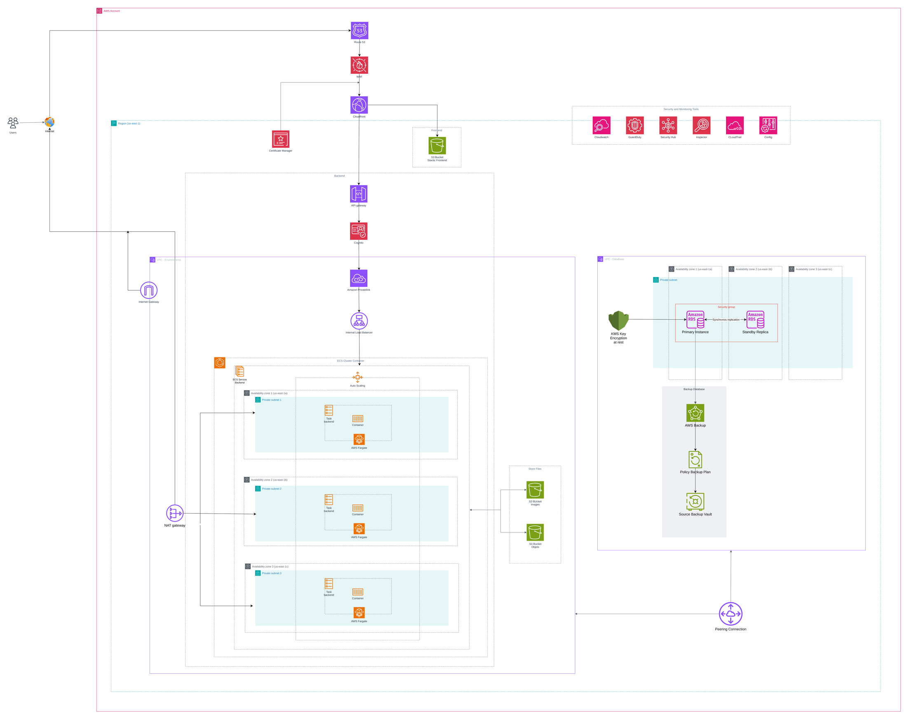
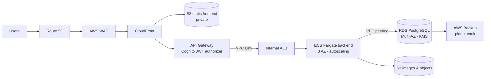

# AWS Cloud-Native Reference Architecture

The architecture I design and build for customer-facing web applications on AWS: a static frontend, containerized backend services, a managed relational database and object storage, with security, backup and monitoring built into every layer.

It follows the AWS Well-Architected Framework and is deployed in `us-east-1` across **three Availability Zones**.

The editable diagram is in [`architecture.drawio.svg`](architecture.drawio.svg) (open it with [draw.io](https://app.diagrams.net)). The full design write-up in Spanish is in [`docs/design.es.md`](docs/design.es.md).

## Request flow

## Components and why

| Layer | Service | Why |
| --- | --- | --- |
| DNS | **Route 53** | Managed DNS for the app domain, routes to CloudFront, supports failover routing. |
| Edge | **CloudFront + AWS WAF** | Single entry point and global CDN for static content. WAF at the edge blocks SQL injection, XSS and DDoS traffic before it reaches anything inside the VPC, so the rules are not duplicated per layer. |
| TLS | **Certificate Manager** | Issues and renews certificates for CloudFront and API Gateway; everything in transit is HTTPS/TLS. |
| Frontend | **S3 (private) via CloudFront** | No servers for the frontend. The bucket is private and only CloudFront can read it. |
| Auth | **Cognito** | User sign-up and sign-in. Used as the API Gateway authorizer, so JWTs are validated before a request reaches the backend. |
| API | **API Gateway + VPC Link** | Managed entry point for the backend. VPC Link connects it to the private network without exposing the backend to the internet. |
| Load balancing | **Internal ALB** | Spreads traffic from API Gateway across Fargate tasks in all three AZs and survives the loss of a zone. |
| Compute | **ECS Fargate** | Backend microservices in private subnets, no servers to manage, autoscaling on real demand. Deployed by CI/CD (CodePipeline, GitHub Actions or Azure DevOps). |
| Data | **RDS PostgreSQL Multi-AZ** | Primary for writes and a synchronous standby in another AZ for automatic failover. Encrypted at rest with KMS. Lives in its **own VPC**, reached from the app VPC over peering. |
| Objects | **S3** | Dedicated buckets for images and generated files; durable, cheap, and served through CloudFront. |
| Backup | **AWS Backup** | Central backup plans and a vault for RDS and other critical resources, with retention policies for recovery and compliance. |
| Egress | **NAT Gateway** | Outbound internet for private subnets without inbound exposure. |

## Security and operations

Applied across the whole account:

- **Detection and posture:** Security Hub, GuardDuty, Inspector, AWS Config, CloudTrail.
- **Access:** IAM least privilege, MFA, no static keys in pipelines.
- **Encryption:** KMS at rest, TLS in transit.
- **Monitoring by layer** with CloudWatch:
  - *Infrastructure:* CPU, memory, storage, driving autoscaling.
  - *Data:* IOPS, read/write latency, active connections.
  - *Network:* throughput, packet errors, latency.
  - *Cross-cutting:* distributed traces with X-Ray, authentication error rate (brute-force signal), blocked WAF traffic (DDoS signal).
  - *Cost:* daily spend, cost per transaction, Savings Plans coverage, with AWS Budgets and Cost Explorer alerts.

## Built with code

I build this kind of platform as infrastructure as code. Two working implementations of the same principles:

- [aws-cdk-secure-platform](https://github.com/cfarez19/aws-cdk-secure-platform): ECS Fargate, DocumentDB, four WAF Web ACLs, API Gateway over VPC Link, cross-region backup.
- [aws-cdk-ecs-postgres-platform](https://github.com/cfarez19/aws-cdk-ecs-postgres-platform): ECS Fargate, RDS PostgreSQL 17 with rotated users, Valkey cache, isolated data VPC.

## Author

**Catalina Farez** — AWS Cloud Architect (AWS Certified Solutions Architect – Associate).
I design, migrate and secure AWS platforms for fintech and insurance teams. Available for freelance work.
